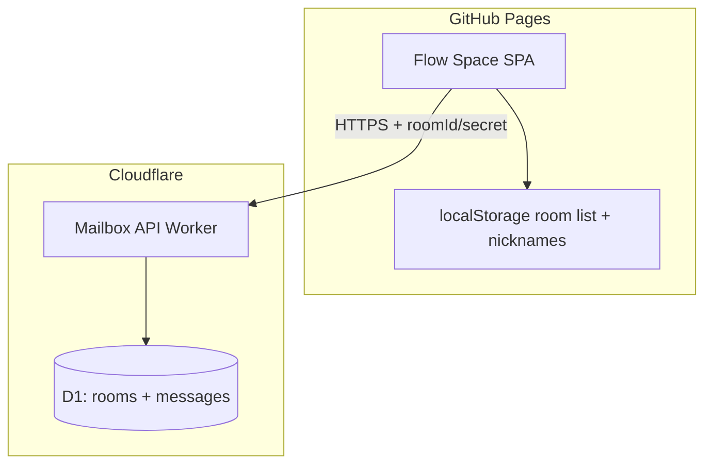

# Flow Space 信箱 — 架构调研（Architecture Spike）

**日期：** 2026-05-17  
**输入：** [requirements-decisions.md](./requirements-decisions.md)、[2026-05-17-mailbox-spec.md](./2026-05-17-mailbox-spec.md)

---

## 1. 约束摘要

| 约束 | 现状 |
|------|------|
| 前端 | Vite + React 18，静态构建，`zustand` + `localStorage` |
| 部署 | GitHub Actions → **GitHub Pages**（仅静态 `dist/`） |
| 信箱 | 必须 **跨用户、跨设备** 同步 → 需要 **HTTP API + 数据库** |
| 团队成本 | 倾向 **低运维**、与静态站解耦 |

结论：**前后端分离** — 页面继续 Pages；API 单独托管。

---

## 2. 方案对比

### 2.1 候选

| 方案 | 描述 | 优点 | 缺点 |
|------|------|------|------|
| **A. Cloudflare Workers + D1** | 边缘 Worker 处理 REST，D1 SQLite | 免费档慷慨、延迟低、与静态 CDN 同生态 | D1 仍属新服务；本地 wrangler 调试要学 |
| **B. Supabase** | Postgres + 自动生成 REST/Realtime | 开发快、Realtime 内置 | 房间鉴权需 RLS 仔细设计；免费档休眠 |
| **C. 自建 Node (Fly/Railway)** | 小型 Express/Fastify + Postgres/SQLite | 完全控制 | 运维、冷启动、与 Pages 两套部署 |
| **D. 纯静态降级** | 导出 JSON + IPFS/邮件 | 零 API | **不满足**一对一社交（已否决） |
| **E. WebRTC P2P** | 无中心服务器 | 隐私 | NAT、信令服、离线消息复杂；不适合 MVP |

### 2.2 推荐：**方案 A（Cloudflare Workers + D1）**

**理由：**

1. Flow Space 已用 GitHub Pages（本质静态 CDN）；Cloudflare 可托管 API，地理上接近用户。  
2. 信箱 API 流量模型简单（CRUD + 轮询），D1 足够 MVP。  
3. `roomSecret` 仅存客户端 fragment + 服务端 `hash(secret)`，与 Workers 无状态模型契合。  
4. 成本：MVP 个人项目通常落在免费额度内。  

**备选：** 若团队更熟 Supabase，可用 **方案 B**，前端调用方式相同（`VITE_MAILBOX_API_URL` 指向 Supabase Edge Functions 或 REST）。

---

## 3. 推荐架构

### 3.1 URL 与鉴权

- 分享链接：`https://<user>.github.io/<repo>/mailbox#<roomId>/<roomSecret>`  
  - 路由：`/` 仍为写作壳；hash 路由或 query 打开 `MailboxPanel` 并解析房间。  
- 请求头或 body 携带 `X-Room-Secret`（或 query，优先 **POST body** 避免日志泄露）。  
- 服务端：`secretHash = SHA-256(roomSecret + pepper)`，`pepper` 为 Worker 环境变量。

### 3.2 参与者槽位

1. `POST /api/rooms` → 创建者即 `senderSlot: a`。  
2. 首个 `POST .../join` 成功 → `b`，`status: active`。  
3. 后续 join → 409 ROOM_FULL。

### 3.3 消息拉取（MVP）

- **短轮询**：面板打开时每 30s `GET messages?since=<iso>`。  
- 面板关闭不轮询（符合「不打扰写作」）。  
- Phase 2：Worker 上 SSE 或 Supabase Realtime。

### 3.4 数据保留

- D1 定时任务（Cron Trigger）或 join 时检查：`lastActivityAt < now - 90d` → `status: archived`（消息可读不可写，或只读 GET）。  
- `DELETE /api/rooms/:id/messages` 软删设置 `deletedAt`。

---

## 4. 前端改动范围（实现时）

| 区域 | 改动 |
|------|------|
| 新增 `src/lib/mailboxApi.ts` | fetch 封装、错误类型 |
| 新增 `src/lib/mailboxStorage.ts` | 本地房间列表、profile |
| 新增 `src/store/mailboxStore.ts` 或扩展现有 store | 房间、消息、UI 状态 |
| 新增 `src/components/MailboxPanel.tsx` | 列表 + 时间线 |
| 修改 `ChromeActions.tsx` | MAIL 按钮 |
| 修改 `App.tsx` | 挂载面板；hash 解析 |
| `vite-env.d.ts` | `VITE_MAILBOX_API_URL` |
| `.github/workflows/deploy-github-pages.yml` | build 时注入 API URL（repository variable） |

**不改动：** WebGL 氛围、ZenTimer 核心逻辑、draft 自动保存路径（除非「从草稿寄出」显式调用）。

---

## 5. 部署与 GitHub Pages 影响

### 5.1 保持不变

- `main` 推送 → `npm run build` → Pages artifact。  
- `VITE_BASE_URL` 逻辑不变。

### 5.2 新增

| 项 | 说明 |
|----|------|
| **Repository variable** | `MAILBOX_API_URL` = `https://mailbox-api.<account>.workers.dev` |
| **Build env** | `VITE_MAILBOX_API_URL: ${{ vars.MAILBOX_API_URL }}` |
| **Worker CI** | [`.github/workflows/deploy-mailbox-worker.yml`](../../.github/workflows/deploy-mailbox-worker.yml) — `cloudflare/wrangler-action` on `workers/mailbox/**` changes |
| **CORS** | Worker 响应头 `Access-Control-Allow-Origin: https://<user>.github.io`（Pages 域）；本地 dev 加 `http://localhost:5173` |
| **无 API 时** | `VITE_MAILBOX_API_URL` 为空 → MAIL 按钮 disabled + 说明「信箱服务未配置」 |

### 5.3 环境矩阵

| 环境 | 前端 | API |
|------|------|-----|
| 本地 | `npm run dev` | `wrangler dev` 或 staging Worker |
| 生产 | GitHub Pages | Cloudflare Worker 生产 |

### 5.4 安全清单

- [ ] `ROOM_SECRET_PEPPER` 仅 Worker secret  
- [ ] 禁止 API 在响应中返回 `roomSecret` 明文（仅创建/rotate 时一次）  
- [ ] Rate limit（KV 或 Durable Object 计数，MVP 可用 D1 + IP 粗限）  
- [ ] 响应头 `Cache-Control: no-store` 于消息接口  

---

## 6. Supabase 备选（简表）

若选用 Supabase：

- 表 `rooms`, `messages`；RLS：`messages` SELECT 需 `room_id` 匹配且 `verify_secret(room_id, secret)` 自定义函数。  
- Realtime 订阅 `messages:room_id=eq.<id>` 可替代轮询。  
- 部署：前端仍 Pages；`VITE_MAILBOX_API_URL` 改为 Supabase project URL + anon key（**仅**能访问 RLS 保护后的操作；敏感 rotate 用 Edge Function）。

---

## 7. 工作量粗估

| 任务 | 人天 |
|------|------|
| Worker + D1 schema + 5 endpoints | 1–1.5 |
| 前端面板 + store + API 客户端 | 2–3 |
| CI/CORS/变量 + 手动验收 | 0.5–1 |
| **合计 MVP** | **4–5.5** |

---

## 8. 决策记录

| 决策 | 选择 |
|------|------|
| 同步层 | Cloudflare Workers + D1（推荐） |
| 前端部署 | 继续 GitHub Pages |
| 实时性 MVP | 30s 轮询 + 手动刷新 |
| 加密 MVP | TLS + 服务端明文；E2E Phase 2 |
| API 配置 | `VITE_MAILBOX_API_URL` build-time 注入 |

---

## 9. 修订记录

| 日期 | 说明 |
|------|------|
| 2026-05-17 | 初版 spike，澄清计划 todo 4 交付 |
